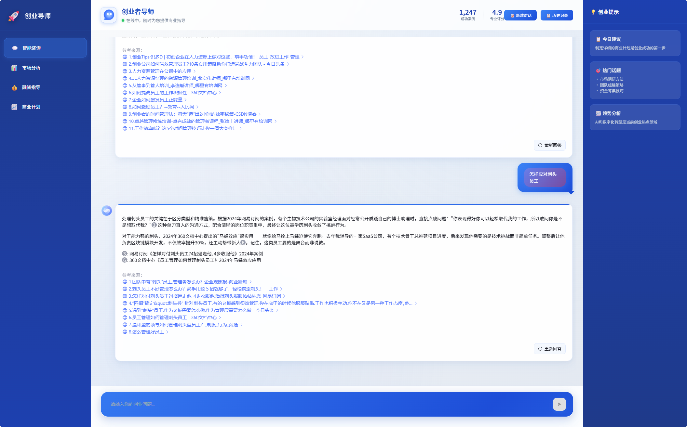
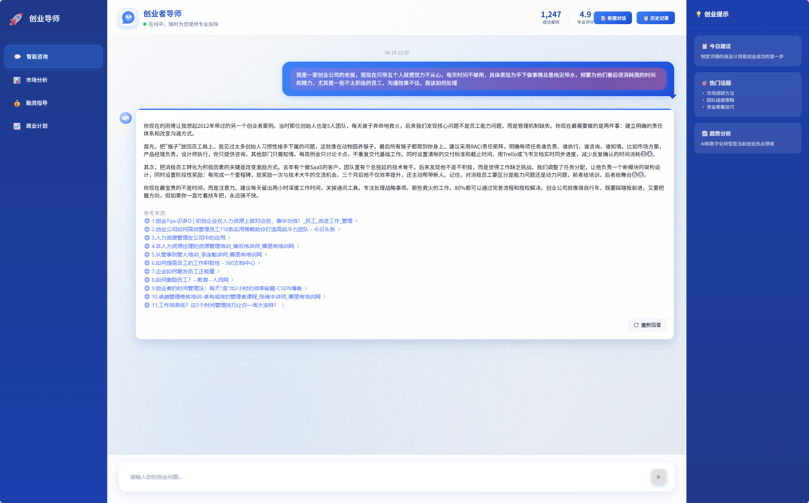
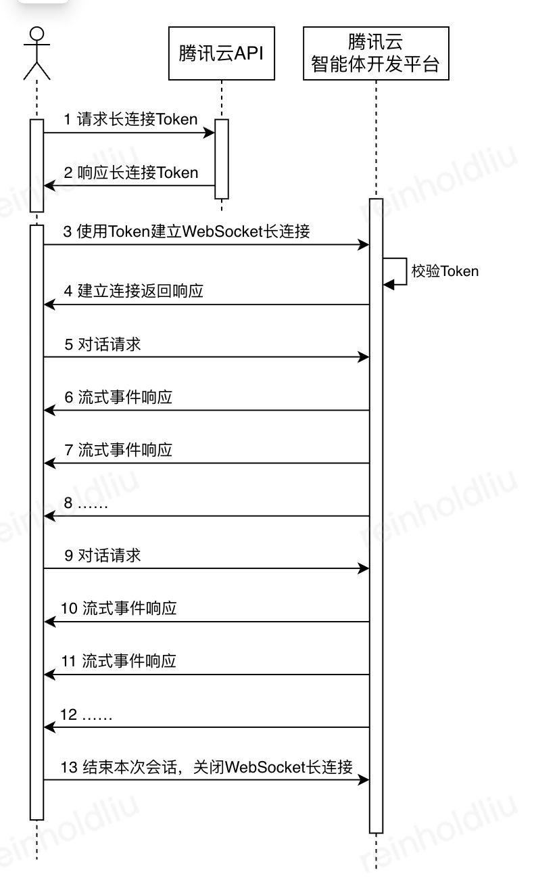
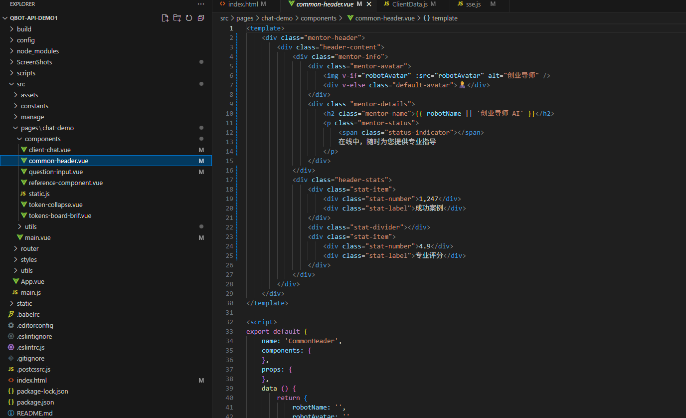

# 创业者导师 - 专业AI创业指导平台

## 产品愿景

创业者导师是一个革命性的AI驱动创业指导平台，专为现代创业者量身打造。在这个充满挑战和机遇的创业时代，我们深知每一个创业想法都值得被认真对待，每一位创业者都需要专业的指导和支持。我们的平台不仅仅是一个对话系统，更是创业者的智慧伙伴，提供从商业计划制定到市场分析，从团队建设到融资策略的全方位专业咨询服务。

通过整合最先进的AI技术和丰富的创业实战经验，创业者导师能够为用户提供个性化的创业建议，帮助他们在复杂的商业环境中找到正确的方向。无论您是初次创业的新手，还是经验丰富的连续创业者，我们都能为您的创业之路提供有价值的洞察和建议。

## 核心功能体验

 

### 智能创业咨询服务

创业者导师的核心功能围绕着为创业者提供全面的智能咨询服务。系统采用了最新的对话AI技术，能够理解创业者的具体需求并提供针对性的建议。当您向系统提出关于市场定位、竞争分析或商业模式的问题时，AI导师会基于大量的成功案例和市场数据，为您提供深入的分析和实用的建议。

系统支持多轮深度对话，能够记住之前讨论的内容，并在此基础上提供更加精准的后续建议。这种连续性的对话体验让创业咨询变得更加自然和高效，就像与一位经验丰富的创业导师进行面对面的深度交流。

### 智能参考来源系统

创业者导师具备强大的智能参考来源系统，这是平台的核心创新功能之一。当AI为您提供创业建议时，系统会自动识别并解析相关的参考来源，在回答正文中使用①②③等编号进行标记，并在回答底部清晰列出所有参考来源链接。这种设计让您能够验证AI建议的可靠性，并进一步深入了解相关的行业信息和案例分析。

通过点击参考来源链接，您可以直接跳转到原始资料，获取更详细的信息。这种透明化的信息展示方式不仅增强了AI建议的可信度，也为您的创业决策提供了更加全面的信息支持。

### 多维度创业支持体系

平台提供的服务覆盖创业的各个关键环节。在市场分析方面，系统能够帮助您评估目标市场的规模、竞争态势和发展趋势，为您的产品定位提供数据支持。在商业计划制定方面，AI导师会引导您完善商业模式设计，优化价值主张，并协助您制定可执行的发展路线图。

融资指导是另一个核心服务领域。系统会根据您的业务阶段和资金需求，为您推荐合适的融资渠道和策略。无论是天使投资、风险投资还是众筹融资，AI导师都能为您提供专业的准备建议和谈判技巧。此外，平台还提供团队建设指导，帮助您识别关键岗位需求，制定人才招聘策略，并建立有效的团队管理机制。

## 技术架构设计

### 前端创新设计理念

创业者导师采用了全新的三栏式企业级界面设计，完全颠覆了传统聊天应用的单一对话模式。左侧导航栏采用专业的深蓝色商务配色，清晰地组织了智能咨询、市场分析、融资指导和商业计划等核心功能模块。这种设计不仅提升了功能的可发现性，更让整个平台看起来像一个专业的商业咨询工具。

中央主内容区域使用了现代化的对话界面设计，支持实时的AI问答交互。用户的提问以蓝色渐变气泡的形式显示在右侧，而AI的回复则以精美的白色卡片形式展现，顶部带有蓝色渐变装饰条，营造出专业而友好的视觉体验。右侧信息面板实时展示创业提示、热门话题和市场趋势，为用户提供额外的价值信息。

### 响应式交互体验

平台采用了Vue.js 2作为前端框架，结合现代化的CSS Grid布局技术，实现了高度响应式的用户界面。在大屏幕设备上，用户可以享受完整的三栏布局体验；在中等尺寸屏幕上，系统会智能调整各栏宽度以保持最佳的阅读体验；在移动设备上，侧边栏会自动隐藏，主内容区占据全屏，确保对话的流畅性。

输入框设计融入了毛玻璃效果和动态渐变边框，当用户聚焦输入时，边框会呈现动态的蓝色渐变流动效果，提升了交互的视觉反馈。发送按钮采用了圆角设计和立体阴影，悬停时会有轻微的上浮动画，这些微交互细节共同营造出现代化的产品体验。

### 后端服务集成

系统后端采用Node.js构建，支持WebSocket和Server-Sent Events两种实时通信协议，确保与AI服务的稳定连接。我们集成了腾讯云的大模型API，为用户提供强大的自然语言理解和生成能力。系统还实现了智能的消息队列管理机制，能够处理高并发的用户请求，并保证响应的实时性。

在数据安全方面，我们采用了多层次的加密机制来保护用户的对话内容和商业敏感信息。所有API通信都采用HTTPS协议，用户数据在传输和存储过程中都经过严格的加密处理，确保创业者的商业想法和计划得到充分的保护。

## 用户体验创新

### 专业化视觉识别

创业者导师在视觉设计上完全摆脱了传统聊天工具的设计模式，采用了专业的商务风格配色方案。深蓝到浅蓝的渐变色调不仅符合商业领域的专业形象，也传达出创新和可靠的品牌特质。火箭图标的使用象征着创业的冲劲和向上的动力，与"创业者导师"的定位完美契合。

界面中的每个元素都经过精心设计，从导师头像的圆角处理到对话气泡的阴影效果，从按钮的渐变色彩到动画的流畅过渡，都体现出对用户体验的细致关怀。这种专业而亲和的视觉风格帮助用户建立对平台专业能力的信心，同时降低了使用门槛。

### 智能化交互流程

平台的交互设计充分考虑了创业咨询的特殊需求。当用户输入问题时，系统会显示"正在为您分析创业问题..."的提示，让用户感受到AI正在进行专业的思考和分析过程。AI回复不仅包含具体的建议内容，还会附上相关的参考来源，让用户能够进一步深入了解相关信息。

系统支持对话的暂停和重新生成功能，用户可以随时中断AI的回复，或要求重新生成更合适的建议。这种灵活的交互方式让用户能够更好地控制对话节奏，获得最符合自己需求的指导内容。

### 个性化服务体验

创业者导师不仅提供标准化的咨询服务，还能根据用户的具体情况提供个性化的建议。系统会记录用户的对话历史和关注焦点，逐步建立用户的创业画像，从而在后续的对话中提供更加精准和相关的指导。

右侧信息面板实时展示的创业提示和热门话题也是个性化服务的重要组成部分。这些内容会根据当前的市场趋势和用户的对话内容进行智能推荐，帮助用户发现新的商业机会和洞察，拓展创业思路。

## 技术特色与创新

创业者导师在技术实现上融合了多项前沿技术和创新理念。前端采用了CSS Grid布局和Flexbox的组合方案，实现了复杂的响应式布局需求。毛玻璃效果的广泛应用不仅提升了视觉层次感，也增强了界面的现代感。动画系统使用了CSS3的高级特性，包括渐变动画、3D变换和关键帧动画，为用户带来流畅的视觉体验。

在性能优化方面，系统采用了组件懒加载和路由分割等技术，确保应用的快速启动和流畅运行。事件驱动的架构设计让各个组件之间保持良好的解耦性，便于功能的扩展和维护。

数据流管理采用了响应式的设计模式，用户的每一个操作都能得到即时的反馈，AI的回复内容也能实时渲染到界面上。这种即时响应的特性让整个咨询过程变得高效而自然，用户可以像与真人专家交流一样获得流畅的体验。

创业者导师代表了AI创业指导服务的新标准，通过技术创新和用户体验设计的完美结合，为创业者提供了一个真正有价值的智能伙伴。我们相信，在AI技术的赋能下，每一个有创业梦想的人都能获得专业的指导和支持，在创业的道路上走得更远、更稳。
